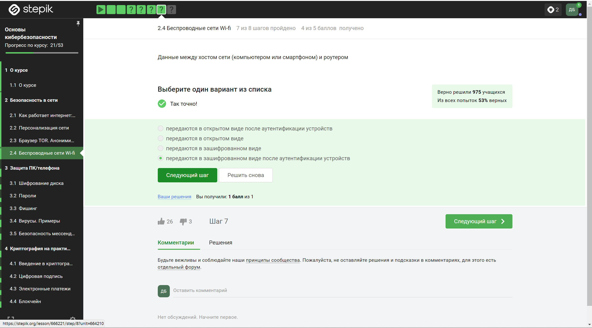

---
# Front matter
title: "Отчёт по выполнению внешних курсов"
subtitle: "Основы кибербезопасности"
author: "Боровиков Даниил Александрович НПИбд-01-22"

# Generic otions
lang: ru-RU
toc-title: "Содержание"

# Bibliography
bibliography: bib/cite.bib
csl: pandoc/csl/gost-r-7-0-5-2008-numeric.csl

# Pdf output format
toc: true # Table of contents
toc_depth: 2
lof: true # List of figures
fontsize: 12pt
linestretch: 1.5
papersize: a4
documentclass: scrreprt
## I18n
polyglossia-lang:
  name: russian
  options:
	- spelling=modern
	- babelshorthands=true
polyglossia-otherlangs:
  name: english
### Fonts
mainfont: PT Serif
romanfont: PT Serif
sansfont: PT Sans
monofont: PT Mono
mainfontoptions: Ligatures=TeX
romanfontoptions: Ligatures=TeX
sansfontoptions: Ligatures=TeX,Scale=MatchLowercase
monofontoptions: Scale=MatchLowercase,Scale=0.9
## Biblatex
biblatex: true
biblio-style: "gost-numeric"
biblatexoptions:
  - parentracker=true
  - backend=biber
  - hyperref=auto
  - language=auto
  - autolang=other*
  - citestyle=gost-numeric
## Misc options
indent: true
header-includes:
  - \linepenalty=10 # the penalty added to the badness of each line within a paragraph (no associated penalty node) Increasing the value makes tex try to have fewer lines in the paragraph.
  - \interlinepenalty=0 # value of the penalty (node) added after each line of a paragraph.
  - \hyphenpenalty=50 # the penalty for line breaking at an automatically inserted hyphen
  - \exhyphenpenalty=50 # the penalty for line breaking at an explicit hyphen
  - \binoppenalty=700 # the penalty for breaking a line at a binary operator
  - \relpenalty=500 # the penalty for breaking a line at a relation
  - \clubpenalty=150 # extra penalty for breaking after first line of a paragraph
  - \widowpenalty=150 # extra penalty for breaking before last line of a paragraph
  - \displaywidowpenalty=50 # extra penalty for breaking before last line before a display math
  - \brokenpenalty=100 # extra penalty for page breaking after a hyphenated line
  - \predisplaypenalty=10000 # penalty for breaking before a display
  - \postdisplaypenalty=0 # penalty for breaking after a display
  - \floatingpenalty = 20000 # penalty for splitting an insertion (can only be split footnote in standard LaTeX)
  - \raggedbottom # or \flushbottom
  - \usepackage{float} # keep figures where there are in the text
  - \floatplacement{figure}{H} # keep figures where there are in the text
---

# Цель работы

Пройти спец. курс “Основы кибербезопасности” и получить сертификат. 

# Выполнение лабораторной работы

## Раздел 2: “Безопасность в сети”

### (2.1) “Как работает интернет: базовые сетевые протоколы”

{ #fig:001 width=110% height=110%}

**Вопрос:** Выберите протокол прикладного уровня  
**Ответ:**  
- HTTPS  
- UPD – транспортного уровня  
- TCP – транспортного уровня  
- HTTPS – прикладного уровня  
- IP – сетевого уровня

{ #fig:002 width=110% height=110%}

**Вопрос:** На каком уровне работает протокол TCP?  
**Ответ:** TCP работает на транспортном уровне, который является 4-м уровнем в модели OSI

{ #fig:003 width=110% height=110%}
**Вопрос:** Выберите все корректные адреса IPv4  
**Ответ:** Корректные адреса IPv4 состоят из чисел от 0 до 255

{ #fig:004 width=110% height=110%}

**Вопрос:** DNS сервер это  
**Ответ:** DNS сервер - система, переводящая доменные имена в IP-адреса, позволяя пользователям легко находить веб-сайты в интернете.

{ #fig:005 width=110% height=110%}

**Вопрос:** Выберите корректную последовательность протоколов в модели TCP/IP  
**Ответ:** В модели TCP/IP, которая является набором сетевых протоколов, используемых для передачи данных в интернете, протоколы организованы в четыре уровня: прикладной - транспортный - сетевой - канальный

{ #fig:006 width=110% height=110%}

**Вопрос:** Протокол http предполагает  
**Ответ:** Протокол HTTP предполагает стандартный способ передачи веб-страниц от сервера к клиенту

{ #fig:007 width=110% height=110%}

**Вопрос:** Протокол https состоит из  
**Ответ:** Протокол HTTPS включает в себя две основные фазы в процессе установления защищенного соединения между клиентом и сервером:  
1. **Фаза рукопожатия:** В этой фазе клиент и сервер обмениваются информацией, необходимой для установления безопасного соединения.  
2. **Фаза передачи данных:** После успешного рукопожатия и установления защищенного канала связи начинается передача зашифрованных данных.

{ #fig:008 width=110% height=110%}

**Вопрос:** Версия протокола TLS определяется  
**Ответ:** Версия протокола TLS определяется и клиентом, и сервером в процессе “переговоров”. Процесс переговоров - согласование обоих сторон на общие параметры безопасности, для обеспечения надежного и защищенного соединения.

{ #fig:009 width=110% height=110%}

**Вопрос:** В фазе “рукопожатия” протокола TLS не предусмотрено  
**Ответ:** В фазе “рукопожатия” протокола TLS не предусмотрено шифрование

### (2.2) “Персонализация сети”

{ #fig:010 width=110% height=110%}

**Вопрос:** Куки хранят:  
**Ответ:** Куки - это небольшие текстовые файлы, которые веб-сайты могут использовать для хранения информации на компьютере пользователя. IP хранится в базе данных провайдеров интернет-услуг. А пароли пользователей обычно хранятся в базах данных на серверах приложений или веб-сайтов.

{ #fig:011 width=110% height=110%}

**Вопрос:** Куки не используются для  
**Ответ:** Для улучшения надежности сетевого соединения используются различные технологии и протоколы (TCP, HTTPS)

{ #fig:012 width=110% height=110%}

**Вопрос:** Куки генерируются  
**Ответ:** Когда пользователь посещает веб-сайт, сервер может отправить куки в браузер пользователя для сохранения определённой информации.

{ #fig:013 width=110% height=110%}

**Вопрос:** Сессионные куки хранятся в браузере?  
**Ответ:** Сессионные куки хранятся в браузере на время пользования веб-сайтом

### (2.3) “Браузер TOR. Анонимизация”

{ #fig:014 width=110% height=110%}

**Вопрос:** Сколько промежуточных узлов в луковой сети TOR?  
**Ответ:** В сети TOR всего 3 промежуточных узла

{ #fig:015 width=110% height=110%}

**Вопрос:** IP-адрес получателя известен  
**Ответ:** IP-адрес получателя известен только отправителю и выходному узлу

{ #fig:016 width=110% height=110%}

**Вопрос:** Отправитель генерирует общий секретный ключ  
**Ответ:** Отправитель генерирует общий секретный ключ с охранным, промежуточным и выходным ключом.

{ #fig:017 width=110% height=110%}

**Вопрос:** Должен ли получатель использовать браузер Tor (или другой браузер, основанный на луковой маршрутизации) для успешного получения пакетов?  
**Ответ:** Эти браузеры полезны для обеспечения анонимности в Интернете, а не для успешного получения пакетов.

### (2.4) “Беспроводные сети Wi-fi”

{ #fig:018 width=110% height=110%}

**Вопрос:** Wi-Fi это  
**Ответ:** Wi-Fi - это беспроводная технология, которая позволяет электронным устройствам подключаться к интернету или обмениваться данными через радиоволны без физического подключения к проводной сети.

{ #fig:019 width=110% height=110%}

**Вопрос:** На каком уровне работает протокол WiFi?  
**Ответ:** WiFi протокол работает на канальном уровне

{ #fig:020 width=110% height=110%}

**Вопрос:** Небезопасный метод обеспечения шифрования и аутентификации в сети Wi-Fi  
**Ответ:** WEP считается небезопасным для шифрования и аутентификации в Wi-Fi

{ #fig:021 width=110% height=110%}

**Вопрос:** Данные между хостом сети (компьютером или смартфоном) и роутером  
**Ответ:** Данные между хостом сети (компьютером или смартфоном) и роутером передаются в зашифрованном виде после аутентификации устройств

{ #fig:022 width=110% height=110%}

**Вопрос:** Для домашней сети для аутентификации обычно используется метод  
**Ответ:** Для домашней сети для аутентификации обычно используется метод WPA2 Personal

# Вывод 

В  ходе  прохождения  внешних  курсов  были  получены  навыки  о “Безопасности в сети”, “Защите ПК/телефона” и “Криптографии”. 

