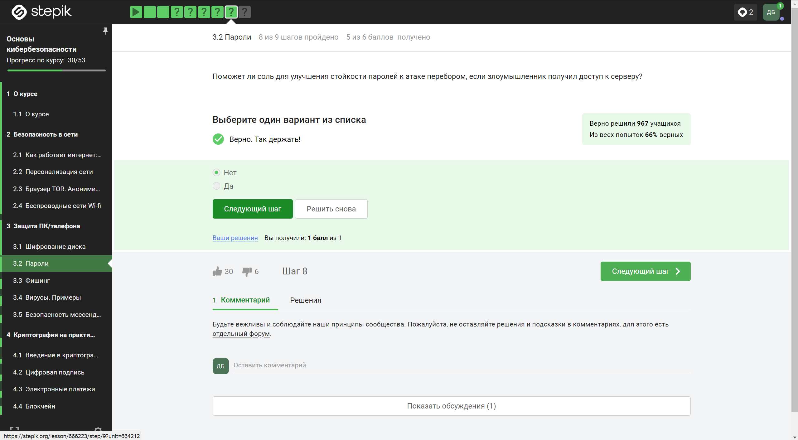

---
# Front matter
title: "Отчёт по выполнению внешних курсов"
subtitle: "Основы кибербезопасности"
author: "Боровиков Даниил Александрович НПИбд-01-22"

# Generic otions
lang: ru-RU
toc-title: "Содержание"

# Bibliography
bibliography: bib/cite.bib
csl: pandoc/csl/gost-r-7-0-5-2008-numeric.csl

# Pdf output format
toc: true # Table of contents
toc_depth: 2
lof: true # List of figures
fontsize: 12pt
linestretch: 1.5
papersize: a4
documentclass: scrreprt
## I18n
polyglossia-lang:
  name: russian
  options:
	- spelling=modern
	- babelshorthands=true
polyglossia-otherlangs:
  name: english
### Fonts
mainfont: PT Serif
romanfont: PT Serif
sansfont: PT Sans
monofont: PT Mono
mainfontoptions: Ligatures=TeX
romanfontoptions: Ligatures=TeX
sansfontoptions: Ligatures=TeX,Scale=MatchLowercase
monofontoptions: Scale=MatchLowercase,Scale=0.9
## Biblatex
biblatex: true
biblio-style: "gost-numeric"
biblatexoptions:
  - parentracker=true
  - backend=biber
  - hyperref=auto
  - language=auto
  - autolang=other*
  - citestyle=gost-numeric
## Misc options
indent: true
header-includes:
  - \linepenalty=10 # the penalty added to the badness of each line within a paragraph (no associated penalty node) Increasing the value makes tex try to have fewer lines in the paragraph.
  - \interlinepenalty=0 # value of the penalty (node) added after each line of a paragraph.
  - \hyphenpenalty=50 # the penalty for line breaking at an automatically inserted hyphen
  - \exhyphenpenalty=50 # the penalty for line breaking at an explicit hyphen
  - \binoppenalty=700 # the penalty for breaking a line at a binary operator
  - \relpenalty=500 # the penalty for breaking a line at a relation
  - \clubpenalty=150 # extra penalty for breaking after first line of a paragraph
  - \widowpenalty=150 # extra penalty for breaking before last line of a paragraph
  - \displaywidowpenalty=50 # extra penalty for breaking before last line before a display math
  - \brokenpenalty=100 # extra penalty for page breaking after a hyphenated line
  - \predisplaypenalty=10000 # penalty for breaking before a display
  - \postdisplaypenalty=0 # penalty for breaking after a display
  - \floatingpenalty = 20000 # penalty for splitting an insertion (can only be split footnote in standard LaTeX)
  - \raggedbottom # or \flushbottom
  - \usepackage{float} # keep figures where there are in the text
  - \floatplacement{figure}{H} # keep figures where there are in the text
---

# Цель работы

Пройти спец. курс “Основы кибербезопасности” и получить сертификат. 

# Выполнение лабораторной работы

## Раздел 3: “Защита ПК/телефона”

### (3.1) “Шифрование диска”

{ #fig:001 width=110% }

**Вопрос:** Можно ли зашифровать загрузочный сектор диска  
**Ответ:** Да, можно зашифровать загрузочный сектор диска  
**Пояснение:** Зашифрованный загрузочный сектор обеспечивает дополнительный уровень безопасности, защищая данные даже на этапе загрузки операционной системы.

{ #fig:002 width=110% height=110%}

**Вопрос:** Шифрование диска основано на  
**Ответ:** Шифрование диска основано на симметричном шифровании  
**Пояснение:** Симметричное шифрование использует один ключ для шифрования и расшифрования данных, что обеспечивает эффективную защиту информации на диске.

{ #fig:003 width=110% height=110%}

**Вопрос:** С помощью каких программ можно зашифровать жесткий диск?  
**Ответ:** С помощью BitLocker и VeraCrypt можно зашифровать жесткий диск  
**Пояснение:** BitLocker (для Windows) и VeraCrypt (кроссплатформенное решение) позволяют зашифровать жесткий диск, обеспечивая защиту данных от несанкционированного доступа.

### (3.2) [“Пароли”](https://stepik.org/lesson/666222/step/1?unit=664211)

{ #fig:004 width=110% height=110%}

**Вопрос:** Какие пароли можно отнести к стойким?  
**Ответ:** UQr9@j4!S$, потому что тут используется сложный набор символов  
**Пояснение:** Сложные пароли, содержащие комбинации символов разного регистра, цифр и специальных символов, обычно являются стойкими к взлому.

{ #fig:005 width=110% height=110%}

**Вопрос:** Где безопасно хранить пароли?  
**Ответ:** Безопасно хранить пароли в менеджерах паролей  
**Пояснение:** Менеджеры паролей обеспечивают шифрование и безопасное хранение паролей, уменьшая риск утечки или взлома учетных данных.

{ #fig:006 width=110% height=110%}

**Вопрос:** Зачем нужна капча?  
**Ответ:** Капча нужна для защиты от автоматизированных атак, направленных на получение несанкционированного доступа  
**Пояснение:** Капча обычно используется для различия между человеком и компьютерной программой, предотвращая автоматизированные атаки на веб-ресурсы.

{ #fig:007 width=110% height=110%}

**Вопрос:** Для чего применяется хэширование паролей?  
**Ответ:** Хэширование паролей применяется для того, чтобы не хранить пароли на сервере в открытом виде.  
**Пояснение:** Хэширование паролей обеспечивает безопасное хранение учетных данных, представляя их в виде непонятных для чтения хэш-значений.

{ #fig:008 width=110% height=110%}

**Вопрос:** Поможет ли соль для улучшения стойкости паролей к атаке перебором, если злоумышленник получил доступ к серверу?  
**Ответ:** Нет, не поможет  
**Пояснение:** Соль используется для усложнения хэширования паролей, но если злоумышленник получил доступ к серверу, он также получит доступ и к соли, уменьшая эффективность ее применения.

{ #fig:009 width=110% height=110%}

**Вопрос:** Какие меры защищают от утечек данных атакой перебором?  
**Ответ:** Всё перечисленное на слайде является отличной защитой  
**Пояснение:** Комбинация сложных паролей, хэширования, соли и других мер безопасности обеспечивает надежную защиту от атак перебором.

### (3.3) [“Фишинг”](https://stepik.org/lesson/666222/step/1?unit=664211)

{ #fig:010 width=110% height=110%}

**Вопрос:** Какие из следующих ссылок являются фишинговыми?  
**Ответ:** Фишинговая ссылка — это мошенническая ссылка, которая выглядит достоверно, но на самом деле используется для кражи личных данных пользователя. Тут подходят сайты Сбербанка (.wix лишняя) и Яндекса (.ucoz лишняя)  
**Пояснение:** Фишинговые сайты часто имитируют легитимные ресурсы, чтобы заполучить личную информацию пользователей.

{ #fig:011 width=110% height=110%}

**Вопрос:** Может ли фишинговый имейл прийти от знакомого адреса?  
**Ответ:** Может, потому что они маскируются под известные пользователям сайты и почты  
**Пояснение:** Злоумышленники могут подделывать адреса отправителей, включая адреса знакомых, чтобы придать их письмам вид легитимности и увеличить вероятность попадания на фишинговые сайты.

### (3.4) “Вирусы. Примеры”

{ #fig:012 width=110% height=110%}

**Вопрос:** Email Спуфинг - это  
**Ответ:** Email Спуфинг - это подмена адреса отправителя в имейлах  
**Пояснение:** Email Спуфинг позволяет злоумышленникам изменять адрес отправителя в электронных письмах с целью маскировки своей личности или создания ложного впечатления.

{ #fig:013 width=110% height=110%}

**Вопрос:** Вирус-троян  
**Ответ:** Он маскируется под легитимную программу или игры, чтобы взломать компьютер или украсть данные  
**Пояснение:** Вирус-троян представляет собой вредоносное программное обеспечение, которое скрыто внедряется в систему под видом полезной программы, чтобы незаметно получить доступ к компьютеру и осуществить кражу данных или другие атаки.

### (3.5) “Безопасность мессенджеров”

{ #fig:014 width=110% height=110%}

**Вопрос:** На каком этапе формируется ключ шифрования в протоколе мессенджеров Signal?  
**Ответ:** Ключ шифрования в протоколе мессенджеров Signal формируется при генерации первого сообщения стороной-отправителем  
**Пояснение:** Протокол мессенджера Signal использует протокол обмена ключами Диффи-Хеллмана, который формирует общий ключ шифрования при первом обмене сообщениями между отправителем и получателем.

{ #fig:015 width=110% height=110%}

**Вопрос:** Суть сквозного шифрования состоит в том, что  
**Ответ:** Суть сквозного шифрования состоит в том, что сообщения передаются по узлам связи (серверам) в зашифрованном виде  
**Пояснение:** Сквозное шифрование (end-to-end encryption) обеспечивает защищенную передачу данных между отправителем и получателем, где сообщения шифруются на устройстве отправителя и расшифровываются только на устройстве получателя, минуя промежуточные серверы.

# Вывод 

В  ходе  прохождения  внешних  курсов  были  получены  навыки  о “Безопасности в сети”, “Защите ПК/телефона” и “Криптографии”. 

