---
# Front matter
title: "Отчёт по выполнению внешних курсов"
subtitle: "Основы кибербезопасности"
author: "Боровиков Даниил Александрович НПИбд-01-22"

# Generic otions
lang: ru-RU
toc-title: "Содержание"

# Bibliography
bibliography: bib/cite.bib
csl: pandoc/csl/gost-r-7-0-5-2008-numeric.csl

# Pdf output format
toc: true # Table of contents
toc_depth: 2
lof: true # List of figures
fontsize: 12pt
linestretch: 1.5
papersize: a4
documentclass: scrreprt
## I18n
polyglossia-lang:
  name: russian
  options:
	- spelling=modern
	- babelshorthands=true
polyglossia-otherlangs:
  name: english
### Fonts
mainfont: PT Serif
romanfont: PT Serif
sansfont: PT Sans
monofont: PT Mono
mainfontoptions: Ligatures=TeX
romanfontoptions: Ligatures=TeX
sansfontoptions: Ligatures=TeX,Scale=MatchLowercase
monofontoptions: Scale=MatchLowercase,Scale=0.9
## Biblatex
biblatex: true
biblio-style: "gost-numeric"
biblatexoptions:
  - parentracker=true
  - backend=biber
  - hyperref=auto
  - language=auto
  - autolang=other*
  - citestyle=gost-numeric
## Misc options
indent: true
header-includes:
  - \linepenalty=10 # the penalty added to the badness of each line within a paragraph (no associated penalty node) Increasing the value makes tex try to have fewer lines in the paragraph.
  - \interlinepenalty=0 # value of the penalty (node) added after each line of a paragraph.
  - \hyphenpenalty=50 # the penalty for line breaking at an automatically inserted hyphen
  - \exhyphenpenalty=50 # the penalty for line breaking at an explicit hyphen
  - \binoppenalty=700 # the penalty for breaking a line at a binary operator
  - \relpenalty=500 # the penalty for breaking a line at a relation
  - \clubpenalty=150 # extra penalty for breaking after first line of a paragraph
  - \widowpenalty=150 # extra penalty for breaking before last line of a paragraph
  - \displaywidowpenalty=50 # extra penalty for breaking before last line before a display math
  - \brokenpenalty=100 # extra penalty for page breaking after a hyphenated line
  - \predisplaypenalty=10000 # penalty for breaking before a display
  - \postdisplaypenalty=0 # penalty for breaking after a display
  - \floatingpenalty = 20000 # penalty for splitting an insertion (can only be split footnote in standard LaTeX)
  - \raggedbottom # or \flushbottom
  - \usepackage{float} # keep figures where there are in the text
  - \floatplacement{figure}{H} # keep figures where there are in the text
---

# Цель работы

Пройти спец. курс “Основы кибербезопасности” и получить сертификат. 

# Выполнение лабораторной работы

## Раздел 4: “Криптография на практике”

### (4.1) “Введение в криптографию”

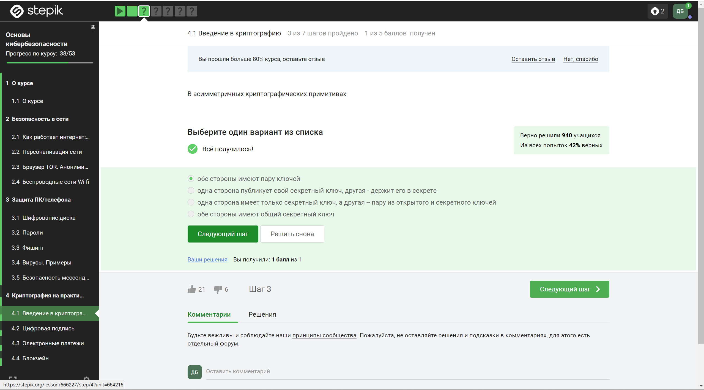{ #fig:004_01 width=110% height=110%}

**Вопрос:** В асимметричных криптографических примитивах  

**Ответ:** Обе стороны имеют пару ключей

*Пояснение:* В асимметричной криптографии каждая сторона имеет два ключа: открытый и закрытый.

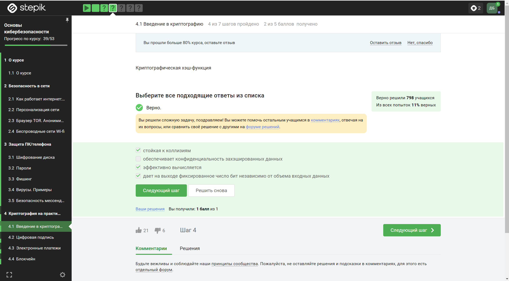{ #fig:004_02 width=110% height=110%}

**Вопрос:** Криптографическая хэш-функция 
 
**Ответ:** Всё верно, кроме пункта “обеспечивает конфиденциальность захэшированных данных”

*Пояснение:* Хэш-функция обеспечивает целостность данных, но не конфиденциальность.

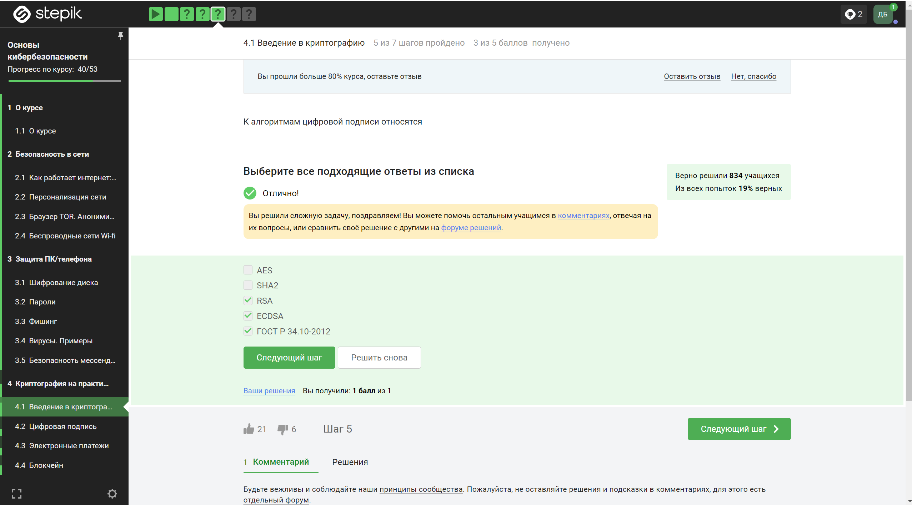{ #fig:004_03 width=110% height=110%}

**Вопрос:** К алгоритмам цифровой подписи относятся  

**Ответ:** RSA, ECDSA и ГОСТ Р 34.10-2012. SHA2— это семейство криптографических хеш- функций, а AES - это алгоритм симметричного шифрования.

*Пояснение:* Алгоритмы цифровой подписи используются для аутентификации и целостности данных.

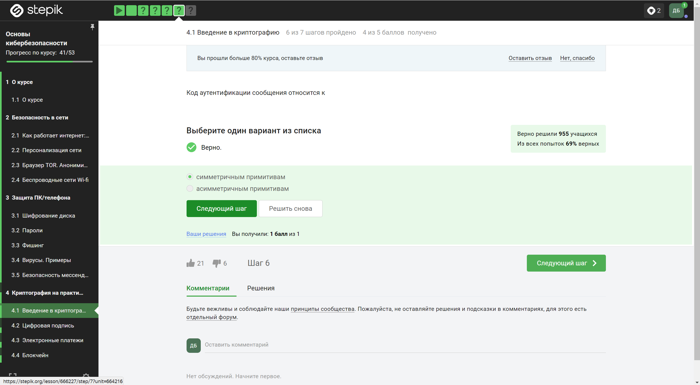{ #fig:004_04 width=110% height=110%}

**Вопрос:** Код аутентификации сообщения относится к  

**Ответ:** Код аутентификации сообщения относится к симметричным примитивам

*Пояснение:* MAC (Message Authentication Code) — это симметричный примитив для аутентификации сообщений.

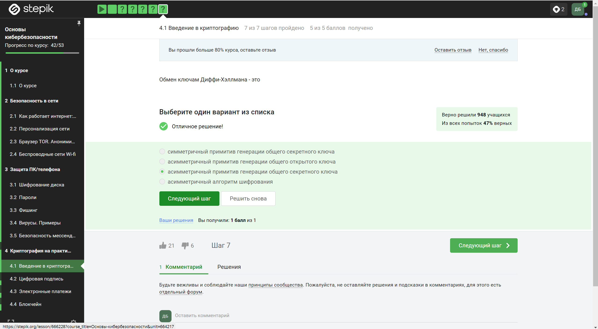{ #fig:004_05 width=110% height=110%}

**Вопрос:** Обмен ключам Диффи-Хэллмана - это  

**Ответ:** Обмен ключам Диффи-Хэллмана – это асимметричный примитив генерации общего секретного ключа

*Пояснение:* Диффи-Хэллман используется для безопасного обмена секретными ключами через открытые каналы.

### (4.2) “Цифровая подпись”

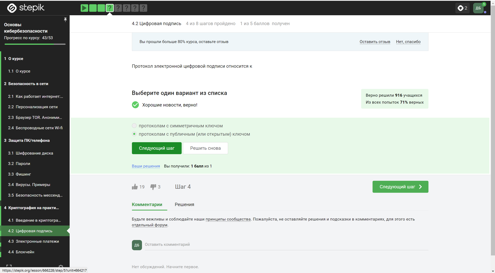{ #fig:004_06 width=110% height=110%}

**Вопрос:** Протокол электронной цифровой подписи относится к  

**Ответ:** Он относится к протоколам с публичным (или открытым) ключом

*Пояснение:* Протоколы электронной цифровой подписи используют открытые ключи для проверки подписи.

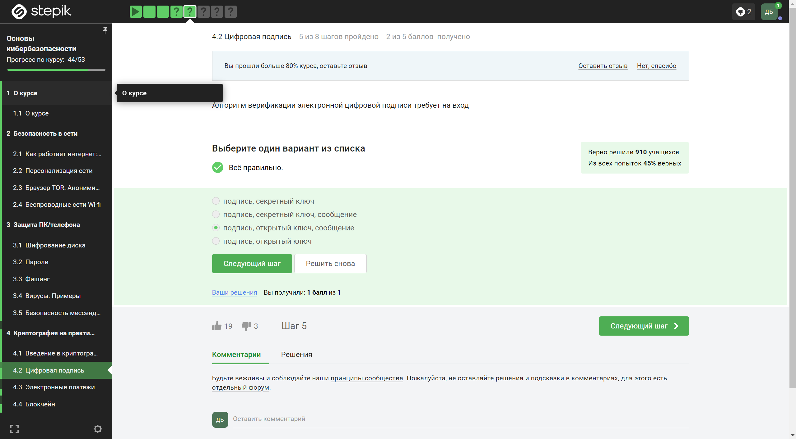{ #fig:004_07 width=110% height=110%}

**Вопрос:** Алгоритм верификации электронной цифровой подписи требует на вход  

**Ответ:** Этот алгоритм вход требует подпись, открытый ключ, сообщение

*Пояснение:* Для верификации электронной цифровой подписи требуется подпись, соответствующий открытый ключ и сообщение.

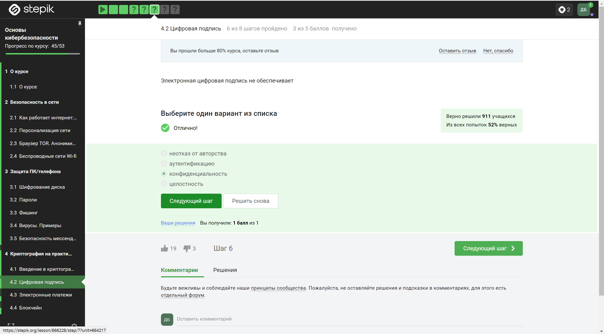{ #fig:004_08 width=110% height=110%}

**Вопрос:** Электронная цифровая подпись не обеспечивает 
 
**Ответ:** Электронная цифровая подпись не может обеспечить конфиденциальность

*Пояснение:* Цифровая подпись обеспечивает аутентификацию и целостность, но не конфиденциальность.

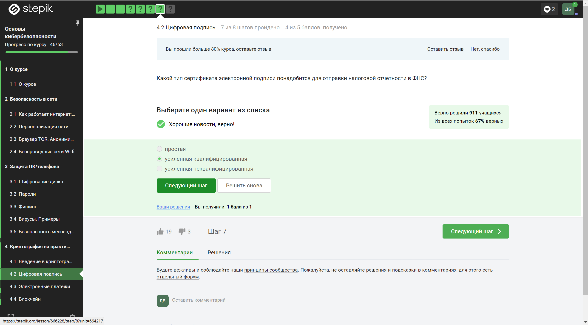{ #fig:004_09 width=110% height=110%}

**Вопрос:** Какой тип сертификата электронной подписи понадобится для отправки налоговой отчетности в ФНС?  

**Ответ:** ФНС требует сертификат электронной подписи с усиленной квалификацией

*Пояснение:* Для отправки налоговой отчетности в ФНС требуется сертификат с усиленной квалификацией.

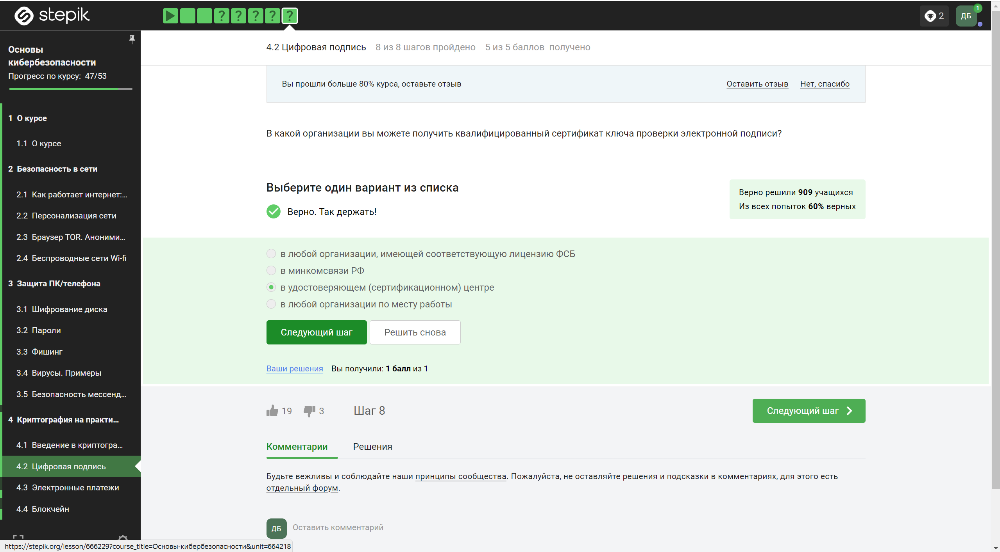{ #fig:004_10 width=110% height=110%}

**Вопрос:** В какой организации вы можете получить квалифицированный сертификат ключа проверки электронной подписи?  

**Ответ:** Сертификаты ключа проверки электронной подписи выдаются в сертификационном центре

*Пояснение:* Квалифицированные сертификаты ключа проверки электронной подписи выдаются в специальных сертификационных центрах.

### (4.3) “Электронные платежи”

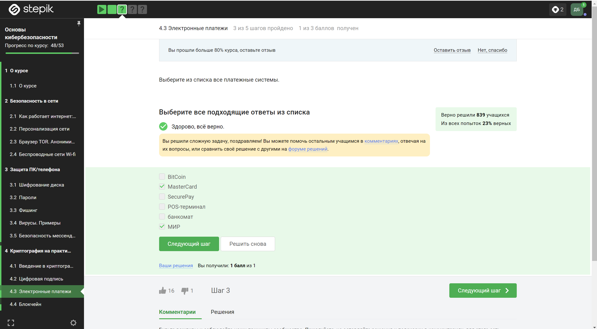{ #fig:004_11 width=110% height=110%}

**Вопрос:** Выберите из списка все платежные системы.  

**Ответ:** МИР и MasterCard являются платежными системами

*Пояснение:* МИР и MasterCard представляют собой платежные системы, через которые можно осуществлять денежные переводы и платежи.

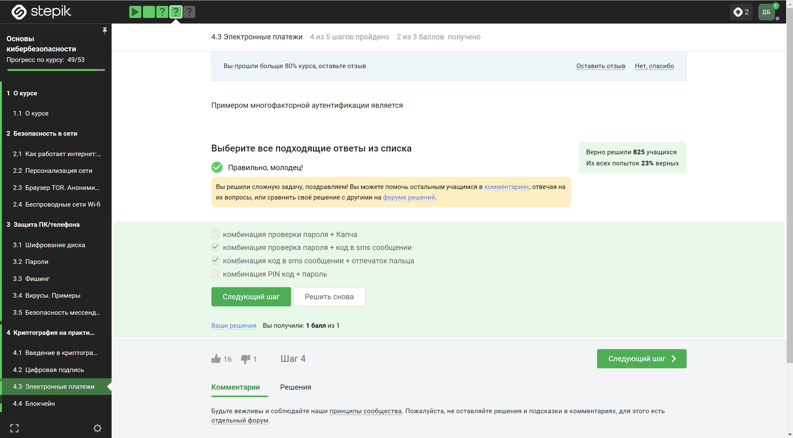{ #fig:004_12 width=110% height=110%}

**Вопрос:** Примером многофакторной аутентификации является  

**Ответ:** К многофакторной аутентификации относятся: проверка пароля, код в sms сообщении и отпечаток пальца

*Пояснение:* Многофакторная аутентификация включает в себя несколько методов проверки личности, таких как пароль, SMS-коды и биометрические данные.

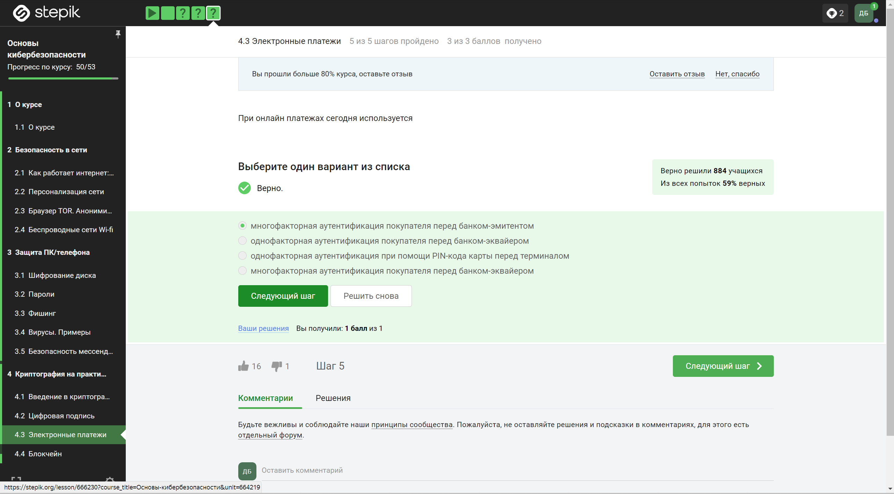{ #fig:004_13 width=110% height=110%}

**Вопрос:** При онлайн платежах сегодня используется 
 
**Ответ:** Онлайн платежи используют многофакторную аутентификацию покупателя перед банком-эмитентом

*Пояснение:* Для повышения безопасности онлайн платежей часто требуется многофакторная аутентификация клиента перед банком-эмитентом.

### (4.4) “Блокчейн”

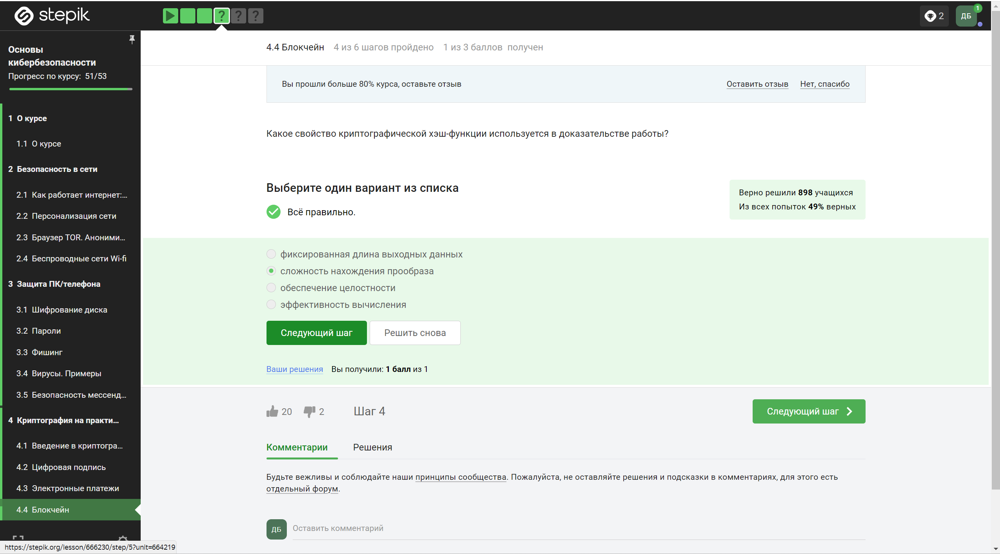{ #fig:004_14 width=110% height=110%}

**Вопрос:** Какое свойство криптографической хэш-функции используется в доказательстве работы?
  
**Ответ:** Используется сложность нахождения прообраза

*Пояснение:* В доказательстве работы используется свойство хэш-функции, обеспечивающее сложность нахождения прообраза.

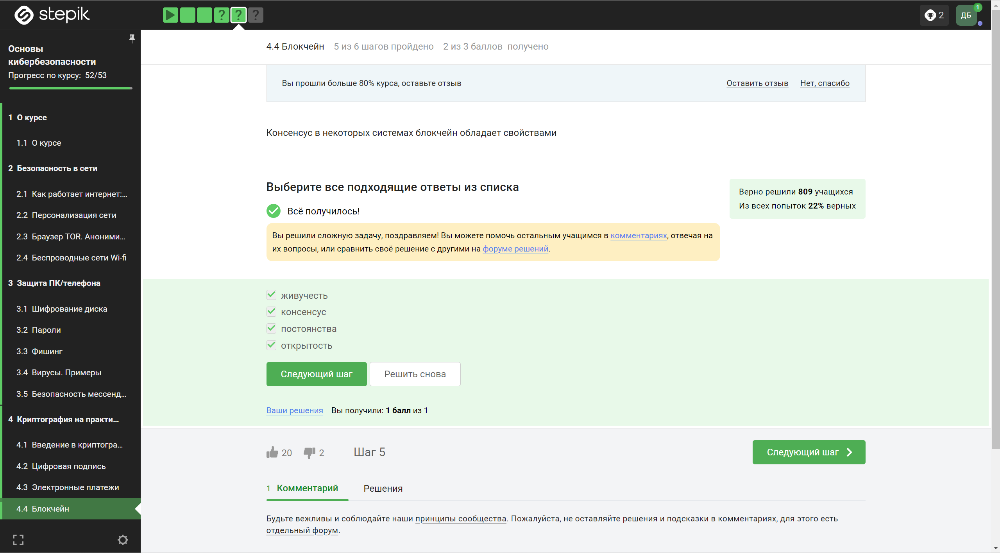{ #fig:004_15 width=110% height=110%}

**Вопрос:** Консенсус в некоторых системах блокчейн обладает свойствами  

**Ответ:** Обладает всеми перечисленными свойствами

*Пояснение:* Консенсус в блокчейне может обладать свойствами, такими как надежность, децентрализация и устойчивость к взлому.

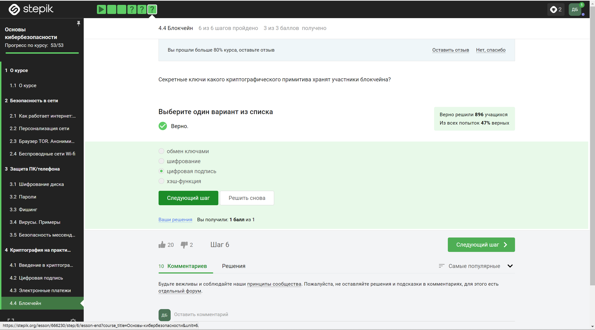{ #fig:004_16 width=110% height=110%}

**Вопрос:** Секретные ключи какого криптографического примитива хранят участники блокчейна?  

**Ответ:** Участники блокчейна хранят секретные ключи, которые используются для цифровой подписи

**Пояснение:** Секретные ключи в блокчейне используются для создания и проверки цифровых подписей, обеспечивая аутентификацию и целостность данных.

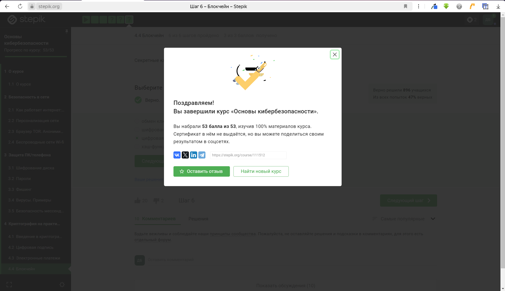{ #fig:004_17 width=110% height=110%}

# Вывод 

В  ходе  прохождения  внешних  курсов  были  получены  навыки  о “Безопасности в сети”, “Защите ПК/телефона” и “Криптографии”. 

